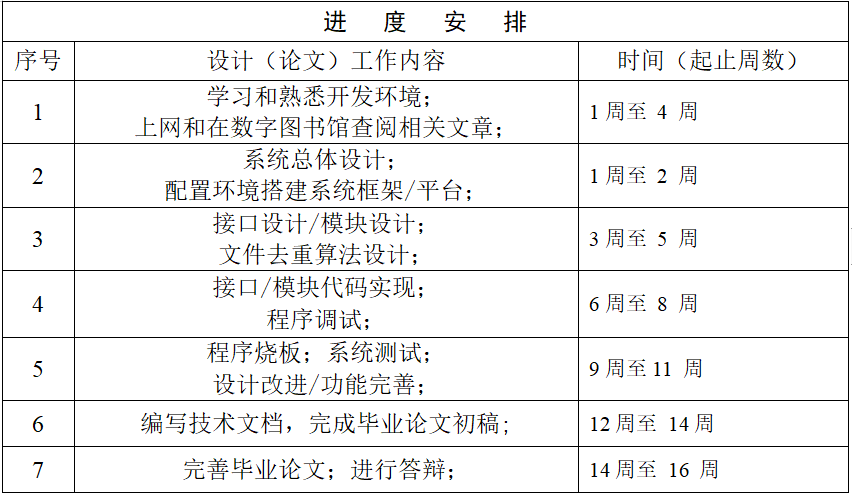

# 基于 OpenHarmony 的分布式文件去重系统设计与实现

## 自我介绍

 我是李为，2023年7月本科毕业于重庆大学计算机学院，保研至本校智能网络实验室，研究兴趣是分布式存储系统和操作系统，毕业设计由陈咸彰老师指导完成。

本项目是我的本科毕业设计，下列内容是本项目的整体介绍。 

## 内容概要
本项目采用C语言在linux虚拟机上设计并了实现分布式文件去重系统，随后将其移植到OpenHarmony操作系统中并在DAYU润和200开发套件上运行测试，测试结果显示在基于移动设备的小型分布式网络中可以起到良好的分布式文件去重的效果。 

## 文档结构
code:全部分布式文件去重系统源代码文件

    -datanode:设备节点源代码

    -ini:初始化文件

    -Metadatanode：中心节点源代码

    -mylibc:自定义远程文件传输库

    -mylibctest:设备节点服务端远程文件接收测试

    -Nodes：虚拟设备节点，内涵3个模拟设备的挂载目录

fig：包含部分系统架构图

docs: 包含开题报告、译文、译文原文、答辩报告和毕业论文对应的pdf和ppt文件

## 系统结构概要

分布式文件系统整体结构如图所示。详细介绍见毕业论文系统设计章节。

## 学习与开发过程记录

学习与开发时间规划如下：

